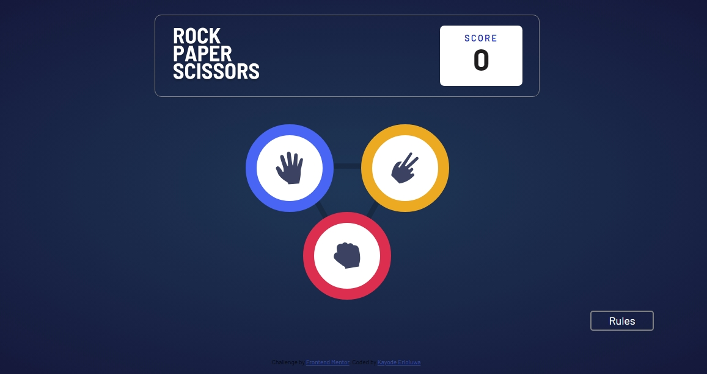

# Frontend Mentor X Web3Bridge - Rock, Paper, Scissors solution

This is a solution to the [Rock, Paper, Scissors challenge on Frontend Mentor](https://www.frontendmentor.io/challenges/rock-paper-scissors-game-pTgwgvgH). Frontend Mentor challenges help you improve your coding skills by building realistic projects. 

## Table of contents

- [Frontend Mentor X Web3Bridge - Rock, Paper, Scissors solution](#frontend-mentor-x-web3bridge---rock-paper-scissors-solution)
  - [Table of contents](#table-of-contents)
  - [Overview](#overview)
    - [The challenge](#the-challenge)
    - [Screenshot](#screenshot)
    - [Links](#links)
  - [My process](#my-process)
    - [Built with](#built-with)
    - [Useful resources](#useful-resources)
  - [Author](#author)

## Overview

### The challenge

Users should be able to:

- View the optimal layout for the game depending on their device's screen size
- Play Rock, Paper, Scissors against the computer
- Maintain the state of the score after refreshing the browser _(optional)_

### Screenshot

### Links

- Solution URL: [https://github.com/Kayodejay/rock-paper-scissors](https://github.com/Kayodejay/rock-paper-scissors)
- Live Site URL: [https://kayodejay.github.io/rock-paper-scissors/](https://kayodejay.github.io/rock-paper-scissors/)

## My process

### Built with

- Semantic HTML5 markup
- CSS custom properties
- Flexbox
- CSS Grid
- Desktop-first workflow
- JavaScript functions
- JavaScript DOM

### Useful resources

- [https://www.youtube.com/watch?v=C6jSg4VPNZE&t=5709s](https://www.youtube.com/watch?v=C6jSg4VPNZE&t=5709s) - I used concepts explained in this tutorial video to understand what had to be done to execute certain functions
- [JavaScript Full Course for Beginners | Complete All-in-One Tutorial | 8 Hours](https://www.youtube.com/watch?v=EfAl9bwzVZk) - This is an amazing complete tutorial video talks about the concepts important when starting out on javascript as a beginner

## Author

- Frontend Mentor - [@Kayodejay](https://www.frontendmentor.io/profile/Kayodejay)
- Twitter - [@jaykayode529](https://www.twitter.com/jaykayode529)

